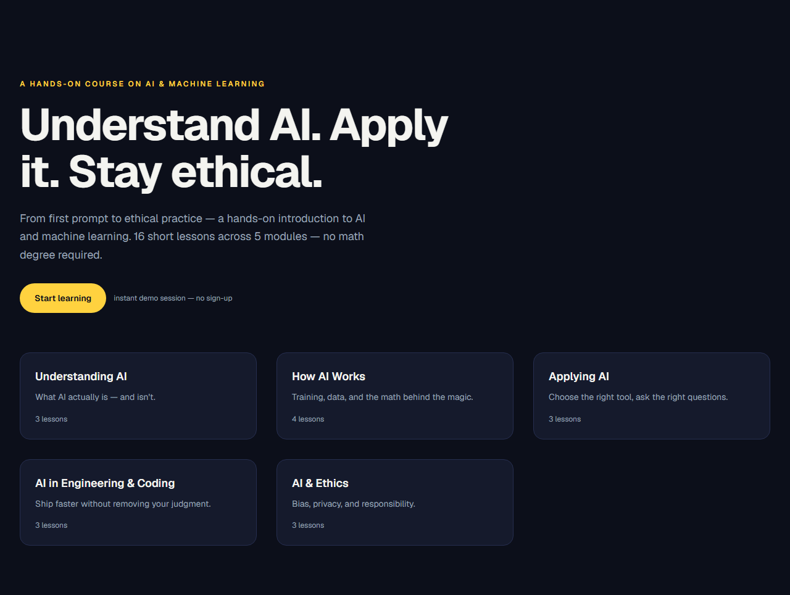
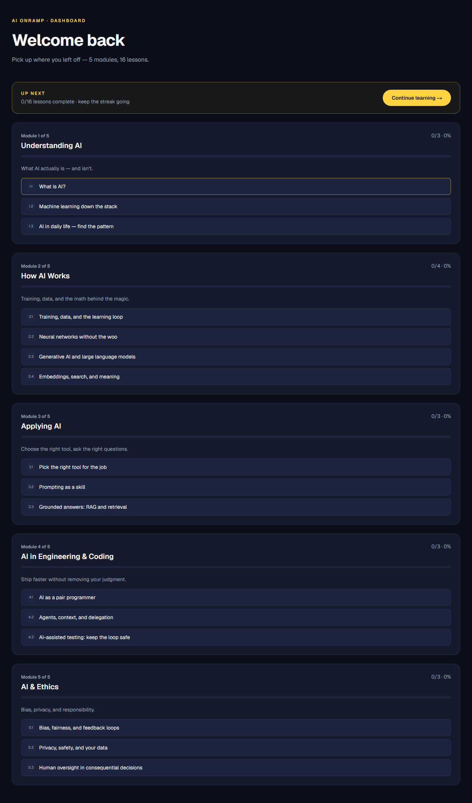
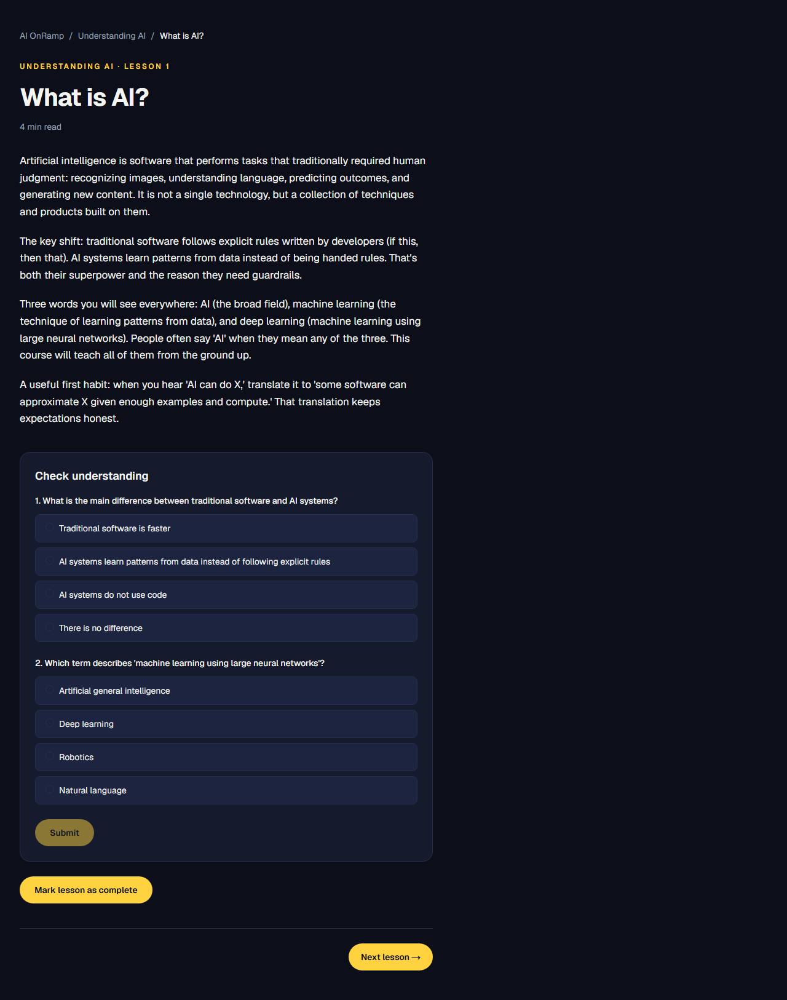
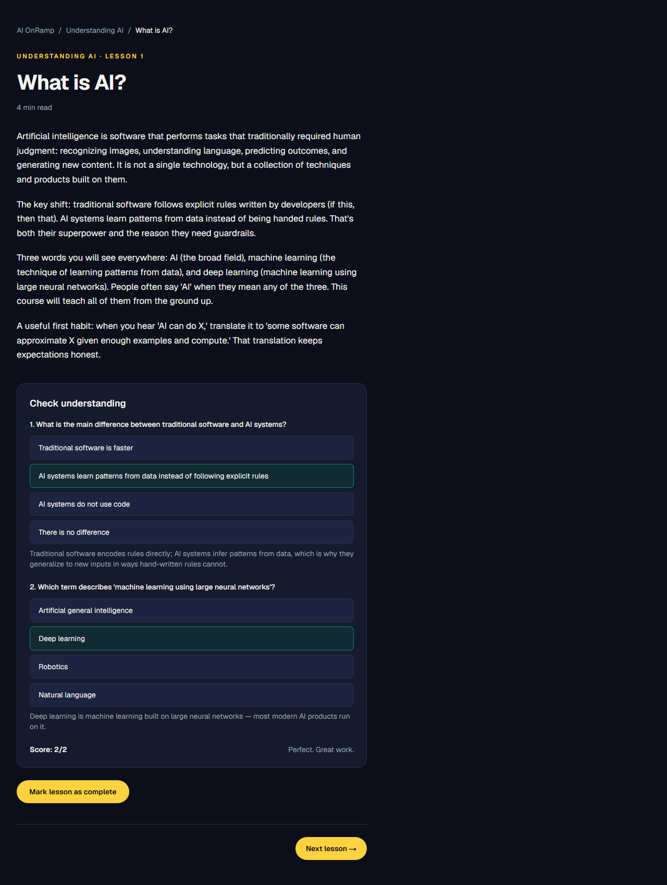
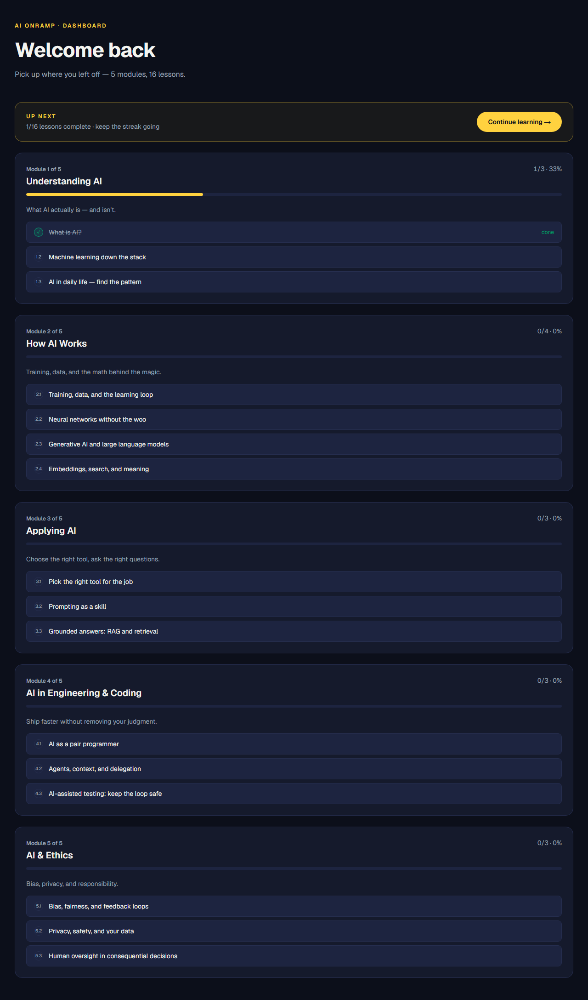

# AI OnRamp

AI OnRamp is a hands-on learning app that teaches AI fundamentals in short, interactive lessons. It is the Week 4 (Phase 2, Project 1) submission for the Cursor Boston x Hult cohort, built against the Ludwitt/Hult learning-app API.

**Production URL:** https://ai-onramp-hult.vercel.app
**Ludwitt/Hult app ID:** `78f5ecd3-4f57-4f7b-9671-0477a1b49f9e`

## Screenshots

| Landing | Dashboard |
|---|---|
|  |  |

| Lesson | Quiz result | Progress |
| --- | --- | --- |
|  |  |  |

## Important note on the API

The official Ludwitt/Hult API endpoints (`api.ludwitt.hult`) were **not resolving during the course week**, so this project runs against the course's **reference implementation**, self-hosted with Turso persistence at `https://ludwitt-api.vercel.app` (public repo: https://github.com/CodingWCal/ludwitt-api). It implements the same contracts — register app, launch token, events, metrics, admin snapshots — and the app's integration is verified live against it. All configuration (`LUDWITT_API_URL`, `LUDWITT_API_KEY`) is env-driven, so pointing at the official platform is a configuration change, not a code change.

## What's inside

- **6 modules / 23 lessons** with in-lesson quizzes, code samples, and instant feedback:
  - Understanding AI (`what-is-ai`, `ml-down-the-stack`, `ai-in-daily-life`, `history-of-ai`)
  - How AI works (`training-and-data`, `neural-networks`, `generative-ai`, `embeddings-and-search`, `llms-and-transformers`)
  - Applying AI (`pick-the-right-tool`, `prompting`, `grounded-ai`, `structured-output-and-tools`)
  - AI and the work (`pair-programming`, `agents-and-context`, `testing-with-ai`, `ai-and-automation`)
  - Building with AI (`picking-models-and-apis`, `rag-and-long-context`, `evaluating-ai-systems`)
  - Ethics (`bias-and-fairness`, `privacy-and-safety`, `human-oversight`)
- **Progress tracking** — per-lesson "mark complete" buttons and a dashboard with per-module progress bars and an "up next" prompt (stored in the browser, no account needed).
- **JWT launch flow** — users arrive via a signed launch token from the Ludwitt/Hult API (`/launch?token=...`), which is verified server-side and exchanged for a 24h HttpOnly session cookie.
- **Events instrumentation** — `lesson_started`, `lesson_completed`, `quiz_submitted`, and a 60s `session_heartbeat` are forwarded to the Ludwitt/Hult events API (`/api/events` -> `POST /v1/apps/{app_id}/events`).
- **Session-gated pages** — `/dashboard` and `/learn/...` require a valid session; `/launch` validates and redirects.

## Tech stack

- Next.js 16 (App Router) + TypeScript (strict) + React 19 + Tailwind CSS v4
- `jose` for JWT verification/signing (launch token + session cookie)
- Deployed on Vercel (Node.js runtime, `force-dynamic` routes for the session-gated pages)

## Setup

```bash
npm install
cp .env.local.example .env.local   # fill in the values below
npm run dev                        # http://localhost:3000
```

| Env var | Purpose |
|---|---|
| `LUDWITT_API_URL` | Base URL of the Ludwitt/Hult API, e.g. `https://ludwitt-api.vercel.app/v1` |
| `LUDWITT_API_KEY` | API key used to authenticate event posts to the Ludwitt/Hult API |
| `LUDWITT_JWT_SECRET` | Secret used to verify the launch-token JWT issued by the API |
| `JWT_SECRET` | Fallback secret for launch-token verification |
| `SESSION_SECRET` | Secret used to sign the app's own session cookie |

## Verification

```bash
npm run lint       # 0 errors
npx tsc --noEmit   # 0 errors
npm run build      # production build passes
```

## Architecture notes

- `app/launch/route.ts` — verifies the launch token and sets the session cookie.
- `lib/session.ts` — JWT verify/sign helpers and cookie name.
- `lib/events.ts` — posts events to the Ludwitt/Hult events API with `user_id` and `session_id`.
- `app/api/events/route.ts` — server-side event proxy that requires a valid session.
- `components/EventTracker.tsx` — client component that fires events (mount, interval).
- `lib/content.ts` — all course content (modules, lessons, quizzes, code samples).
- `components/CourseProgress.tsx` — client-side progress state (`localStorage`) and dashboard widgets.

## Known limitations

| Limitation | Context |
|---|---|
| Session user identity comes only from the launch token | There is no separate sign-up flow; the API issues launch tokens |
| `session_id` is generated per event, not per session | Metrics are user-based, so this does not affect counting |
| Content is static in `lib/content.ts` | No CMS or admin editing surface |
| No automated E2E tests | QA relies on the build/lint/typecheck pipeline plus manual launch-flow checks |
| Heartbeat events are excluded from qualifying metrics | Matches the Ludwitt/Hult API's qualifying-event definition |

## Deployment

Pushes to `main` auto-deploy via Vercel. The production URL is aliased to `ai-onramp-hult.vercel.app`.
