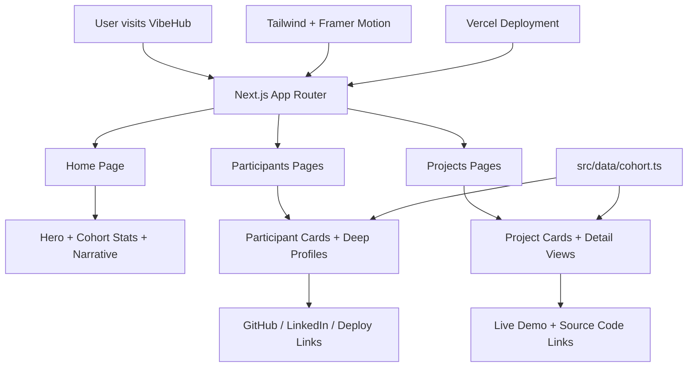

# VibeHub

VibeHub is a public-facing, high-energy marketing platform for Hult Cursor Cohort 3. It showcases the cohort as a living launch surface rather than a static portfolio dump, with participant profiles, project evidence, deployment links, and a partner-facing narrative.

## Overview

This project was built as a Week 3 submission for the Vibe Marketing challenge. The experience is designed to feel credible, polished, and partner-ready while still maintaining a vibrant, modern builder aesthetic.

## Goals

- Present the cohort with momentum and energy
- Highlight individual builders and their work
- Make project outcomes feel tangible and launch-ready
- Create a strong narrative for partners, recruiters, and founders

## Stack

- Next.js (App Router)
- TypeScript
- Tailwind CSS
- Framer Motion
- Lucide Icons

## Project Structure

- `/` — home hub with cohort snapshot and narrative
- `/participants` — roster of cohort builders
- `/participants/[handle]` — deep profile for a specific participant
- `/projects` — showcase of featured projects
- `/projects/[id]` — detailed project story and evidence

## Architecture Notes

The app uses a content-driven data model stored in `src/data/cohort.ts` and renders pages from the Next.js App Router. The interface uses motion-enhanced sections and a dark, neon-accented visual system to reinforce the premium launch-surface feel.

### Architecture Diagram



## Local Development

```bash
npm install
npm run dev
```

## Build

```bash
npm run build
```

## Deployment

The project is intended for deployment on Vercel. A production deploy should point to the Vercel URL used for the submission.

## Notes

- No secrets are committed
- The project is designed to be easily extendable with more participants, projects, and partner-facing content
