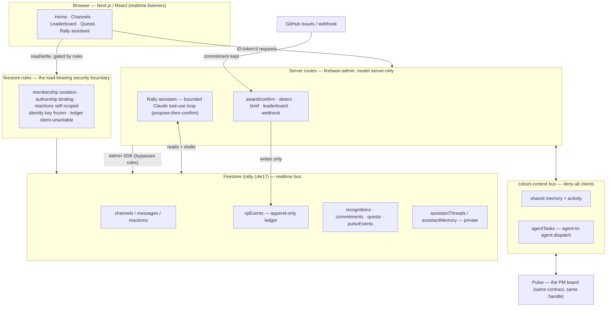
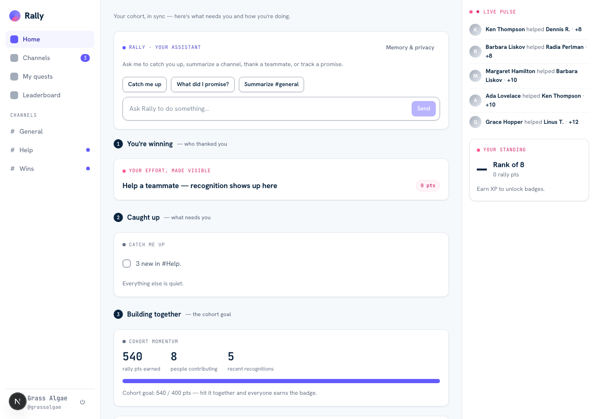
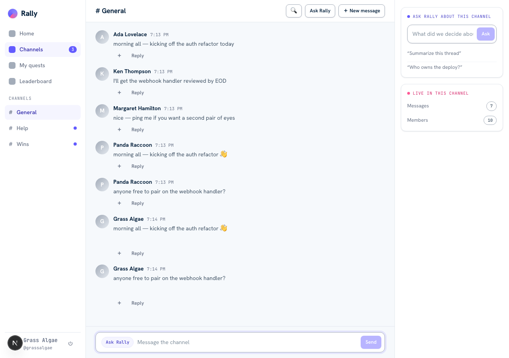
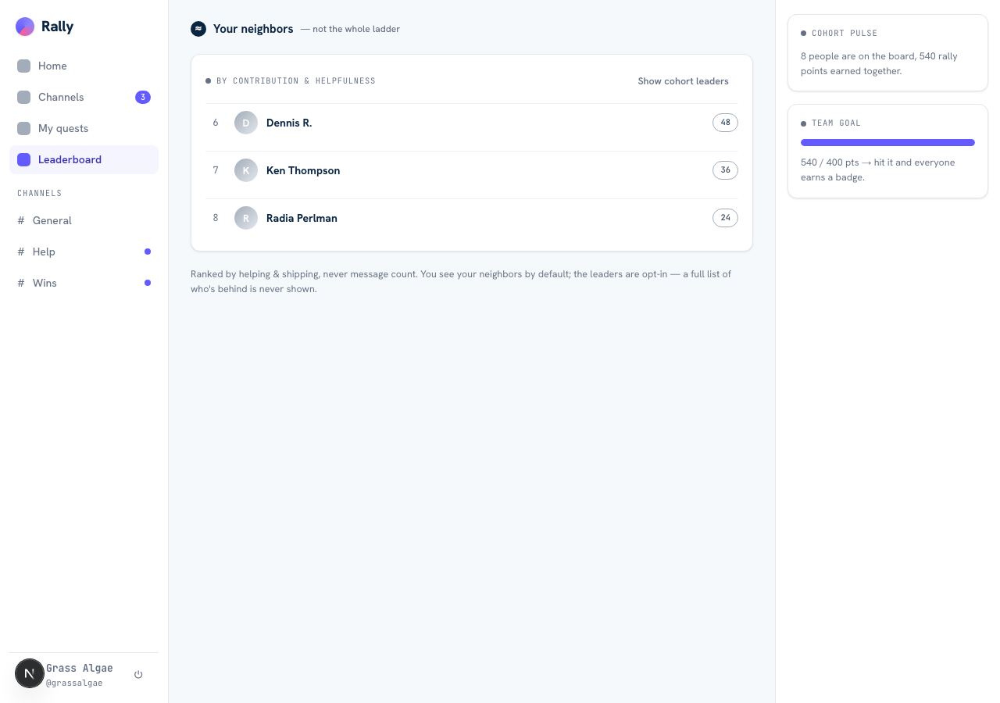
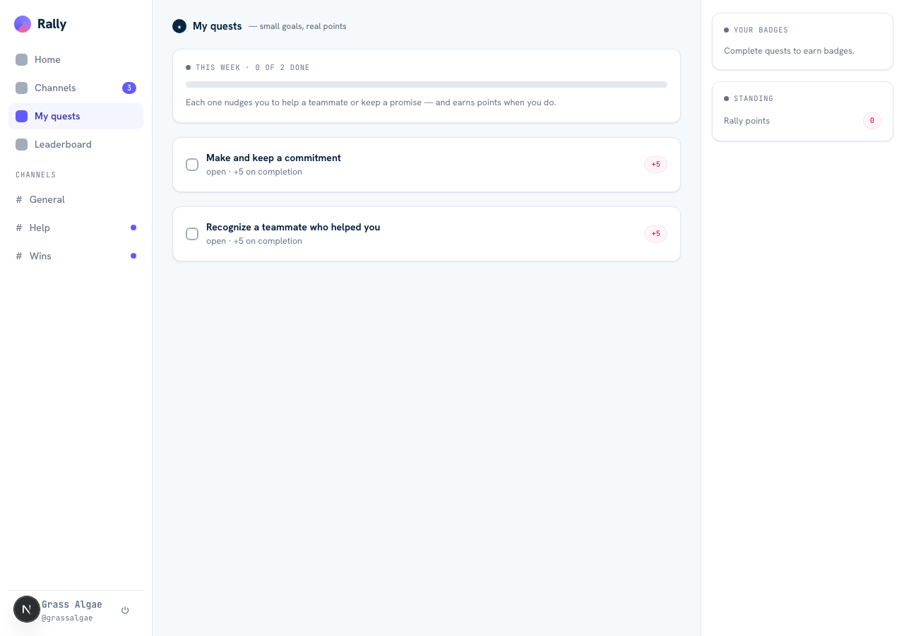

# Rally — architecture & screens

A one-page picture of how Rally is built and what it looks like, so any reader can follow it without
reading the code.

## System at a glance

Next.js 16 (App Router) · React 19 · TypeScript · Tailwind v4. **Firestore is the realtime bus**
(`onSnapshot` — no custom websockets); **Firebase Auth (GitHub)** is identity; **`firebase-admin`**
backs the server routes; **`@anthropic-ai/sdk`** runs server-side only. Every screen is a client
component subscribing to live data.

**The model has no authority.** It classifies, summarizes, and drafts — it never writes a
points-bearing row. Every points write goes through a trusted admin route into the **append-only
`xpEvents` ledger**; clients can never mint XP, and `firestore.rules` proves it. Every intelligence
has a deterministic fallback, so Rally works fully with the model switched off.



## The recognition loop (why XP can't be gamed)

```mermaid
sequenceDiagram
  participant A as Helper (Ada)
  participant B as Helped peer (Linus)
  participant D as detect route
  participant S as recognition-admin
  participant L as xpEvents ledger
  B->>D: "thanks @ada, that unblocked me" (+ sourceMsgRef)
  D->>D: verify Linus authored that message in a channel he's in
  D->>S: suggest recognition (helper=Ada) — no points yet
  Note over B: Linus (the helped peer) taps Confirm
  B->>S: confirm (auth'd; helper can't self-confirm)
  S->>L: append XP to Ada + thanks to Linus — ONE transaction, idempotent
```

Points are only ever written when the **helped peer confirms**; a helper can never award themselves,
detection only ever *proposes*, and the ledger entry uses a deterministic id so a retry awards once.

## Cross-app: the suite is one product

Rally and Pulse share one identity (the GitHub handle, frozen write-once), one drift-guarded
contract, and a server-only bus. Rally's assistant can dispatch a task to Pulse's agent; a note saved
in one app appears in the other. See [`CROSS-APP-VISION.md`](CROSS-APP-VISION.md) for the roadmap and
[`CROSS-APP-AUDIT-REPORT.md`](CROSS-APP-AUDIT-REPORT.md) for the audited seam.

---

## Screens

_Signed-in captures from the running app (regenerate with `npm run screenshots`)._

### Home — recognition-first, three bands
The situation board: **you're winning** (who thanked you), **caught up** (what needs you), and
**building together** (the cooperative cohort goal). The Rally assistant sits on top; the live pulse
and your standing are in the rail.



### Channels — realtime comms
Channels, threads, reactions, unread, @mentions, search — the core that always works, even with the
smart layer off.



### Leaderboard — neighbors-only, be kind to the quiet
Your rank and a ±2 window of neighbors, plus the cooperative team goal. The full ranking is computed
server-side and never returned — no public list of who's behind.



### Quests — personal, always-positive on-ramps
Small personal nudges ("recognize a teammate", "keep a commitment") that award once — never a
comparison, never a penalty.


