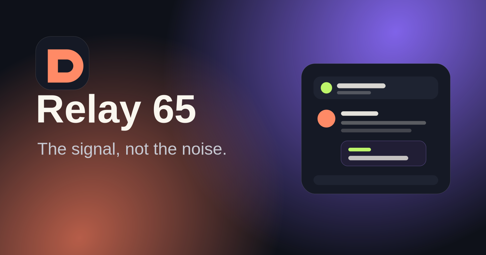
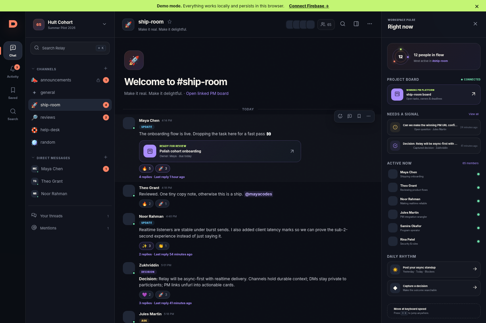
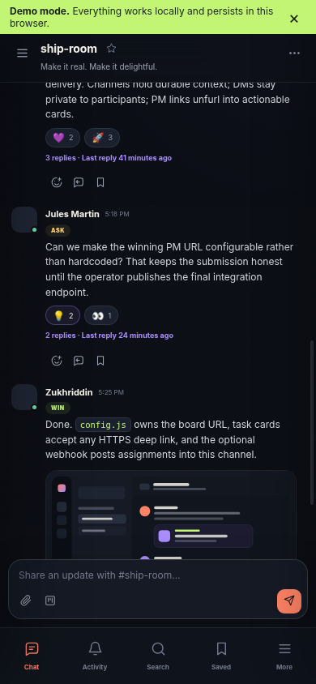

# Relay 65

**The signal, not the noise.** Relay 65 is a polished, async-first communications platform for the Hult Developer Cohort. It replaces the scattered parts of Discord with one focused workspace for channels, direct messages, threads, decisions, asks, wins, peer-review coordination, and project-management links.



## Product preview

<p align="center">
  
  
</p>

## What ships

- **GitHub sign-in** through Firebase Authentication, with GitHub handle, avatar, and verified email enrichment.
- **Persistent public channels** with member-created rooms, rename/archive controls, descriptions, and optional posting permissions; the production data model also preserves member-only private-channel authorization.
- **Private 1:1 direct messages** whose Firestore rules permit reads only by the two participants.
- **Realtime messages and presence** with threads, emoji reactions, mentions, DM/thread notifications, saved messages, and keyword search.
- **Async signal types** — Message, Update, Ask, Decision, and Win — so important communication is scannable instead of noisy.
- **PM integration** through task cards, channel-level board links, and deep links to the selected PM platform. Incoming PM/GitHub webhooks are deliberately deferred in this no-billing release.
- **Reviewer-friendly demo mode** with seeded cohort data and local persistence; no credentials are required to explore the complete interface.
- **Production guardrails** including Firestore rules, ordered indexes, content security headers (including Firebase Auth's required Google API iframe helper), cache-busted public configuration, GitHub-only open enrollment, moderation reports, and PWA support. The visible paperclip explains that attachments are unavailable on the Firebase Spark release.
- **Responsive, accessible interface** with mobile navigation, keyboard command palette (`⌘/Ctrl + K`), light/dark themes, focus states, and reduced-motion support.

For the fastest setup path, open [START_HERE.md](START_HERE.md).

## Run it now

Relay 65 has no frontend build step and no runtime package dependencies.

```bash
cd relay65
python3 -m http.server 4173
```

Open `http://localhost:4173/?demo=1`. Demo data is stored in the browser’s `localStorage`; use a private window for a clean reset.

```bash
npm test
```

The dependency-free root suite checks syntax, required project assets, adapter behavior, evaluated demo/production configuration fixtures, security configuration, and core demo messaging flows. The Spark release passes **24/24** root tests; see [QA_REPORT.md](QA_REPORT.md) for Firestore Emulator evidence and remaining production-only checks.

## Architecture

```text
Browser (vanilla ES modules + PWA)
  ├─ DemoAdapter → localStorage (instant review/demo mode)
  └─ FirebaseAdapter
       ├─ Firebase Auth → GitHub OAuth
       └─ Cloud Firestore → realtime channels, DMs, threads, notifications
```

The active deployment profile is Firebase **Spark core**: Authentication, Firestore, and Hosting only. It does not initialize or deploy Cloud Storage or Cloud Functions. The `storage.rules` and `functions/` source remain in the repository solely as a clearly deferred future Blaze-upgrade path.

The frontend uses a small adapter boundary rather than coupling the UI to Firebase. This makes the interface immediately testable in demo mode and keeps a clean migration path to another backend or the winning project-management platform.

See [ARCHITECTURE.md](ARCHITECTURE.md) for the data model and privacy boundaries.

## Production setup

1. Keep the project on Firebase's no-cost **Spark** plan. Create a Web app, enable Firestore in Production mode, Firebase Hosting, and Firebase Authentication with GitHub. Do not provision Storage or Functions for this release.
2. Copy `config.example.js` to `config.js`, set `demoMode: false`, keep `attachmentsEnabled: false`, add complete Firebase browser values and the winning PM platform URLs, then configure GitHub OAuth in Firebase Authentication.
3. Run `npm test` and the Firestore Emulator smoke test in `emulator/` before production.
4. Deploy only Firestore rules/indexes and Hosting:

   ```bash
   firebase deploy --only firestore:rules,firestore:indexes,hosting
   ```

5. In Firestore Console, create the neutral `settings/workspace` document with `accessMode: "open"`, `cohortCapacity: 65`, and `workspaceName: "Hult Cohort"`. GitHub-authenticated visitors then self-enrol as active `member` profiles. After the owner has enrolled, designate that existing profile as `staff` and set the channel whose `name` is `announcements` to `postingRoles: ["staff"]`; leave the other shared rooms member-postable and run two-account/load QA.

The full click-by-click guide is in [DEPLOYMENT.md](DEPLOYMENT.md). Firebase browser identifiers, the production URL, and the Forth PM URLs are configured for this release. The repository deliberately does **not** contain the GitHub OAuth client secret, Firebase Admin credentials, or webhook secrets. Webhook secrets are only needed for a future Blaze upgrade.

## Requirement coverage

| Program expectation | Relay 65 implementation |
|---|---|
| Cohort-sized multi-user messaging | Firestore listeners, bounded queries, cohort capacity setting, 65-person member directory |
| Public channels | Persistent channels with create/edit/archive and seeded cohort rooms |
| Direct messages | Deterministic private 1:1 conversations |
| Announcements | `#announcements` is readable by every enrolled member but staff-post-only; other shared rooms remain member-postable and private/DM authorization is unchanged |
| Notifications | Mentions, DMs, thread replies, unread activity center |
| Persistence and search | Firestore persistence plus cross-channel/DM keyword search |
| PM integration | Board links, task unfurls, and deep links; inbound webhook ingestion is deferred to a future Blaze upgrade |
| GitHub/shared identity | GitHub OAuth handle/avatar/email profile; PM links use the same configured identity metadata |
| Realtime and async | Live Firestore listeners plus explicit Update/Ask/Decision/Win semantics |
| Production quality | Security rules, CSP headers, moderation, PWA, test suite, deployment docs |

## Project map

```text
index.html                  App shell and accessible UI landmarks
styles.css                 Responsive visual system
src/app.js                 Interaction and rendering controller
src/adapters/demo.js       Persistent local demo backend
src/adapters/firebase.js   Production Firebase backend
src/data.js                Seeded cohort demo content
firestore.rules            Membership, channel, DM, and privacy enforcement
storage.rules              Deferred Blaze-upgrade Storage rule source (not deployed on Spark)
functions/index.js         Deferred Blaze-upgrade signed webhook bridge (not deployed on Spark)
emulator/                  Package-local Firestore Rules smoke test
DEPLOYMENT.md              Production setup and smoke tests
QA_REPORT.md               Automated and browser QA evidence
PR_BODY.md                 Submission-ready pull request copy
SUBMISSION_CHECKLIST.md    Branch, deadline, and merge checklist
```

## Submission identity

- GitHub handle: `zukhriddingit`
- Branch: `participants/summer26/phase-1-project-2/zukhriddingit`
- Base: `projects/summer26/phase-1-project-2`
- Pull request title: `[Project 2] Submission — zukhriddingit`

Use [PR_BODY.md](PR_BODY.md) after replacing its clearly marked production and PM placeholders. Do not commit secrets.

## License

MIT — see [LICENSE](LICENSE).
